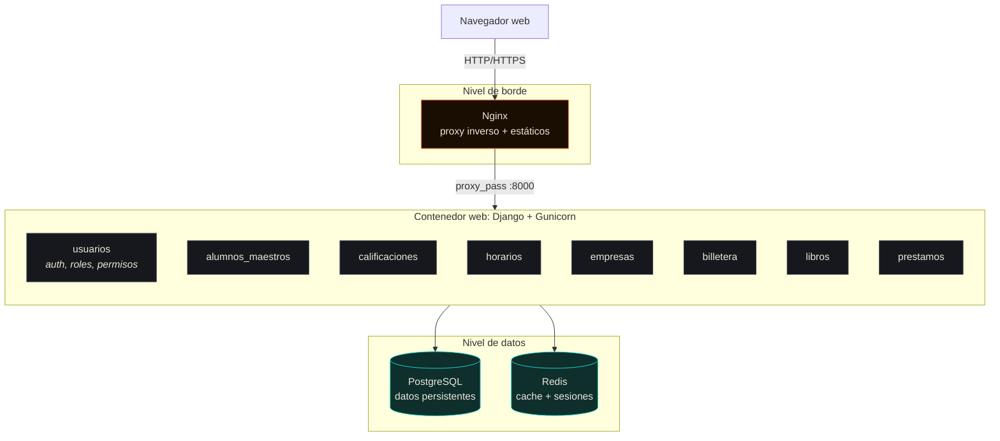
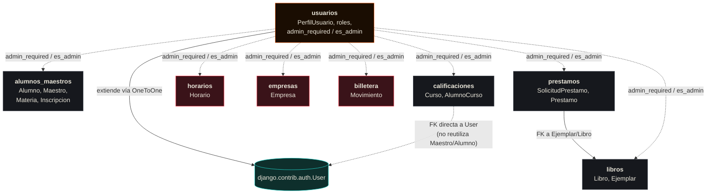
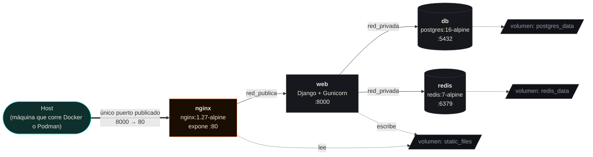

# Arquitectura

## Visión general

Sistema Escolar es un **monolito modular** de Django: una sola aplicación WSGI que agrupa 8 apps internas, cada una responsable de un dominio de negocio. No es (todavía) una arquitectura de microservicios — es un monolito bien organizado, desplegado detrás de un proxy inverso, con la base de datos y la cache en contenedores separados.

## Los 8 módulos (apps de Django)

| App | Responsabilidad | Modelos principales |
|---|---|---|
| `usuarios` | Autenticación, roles (`ADMIN`/`USUARIO`), autorización compartida | `PerfilUsuario` |
| `alumnos_maestros` | Alumnos, maestros, materias, inscripciones | `Alumno`, `Maestro`, `Materia`, `Inscripcion` |
| `calificaciones` | Cursos, captura de calificaciones, firma digital de actas | `Curso`, `AlumnoCurso` |
| `horarios` | Horarios de clase por día/hora | `Horario` |
| `empresas` | Empresas vinculadas a la institución | `Empresa` |
| `billetera` | Movimientos financieros (ingresos/egresos) | `Movimiento` |
| `libros` | Catálogo de libros y sus ejemplares físicos | `Libro`, `Ejemplar` |
| `prestamos` | Solicitudes y préstamos de biblioteca | `SolicitudPrestamo`, `Prestamo` |

Todas comparten el mismo mecanismo de autorización (`usuarios.decorators.admin_required` / `es_admin`), la misma base de datos, y el mismo shell visual (`templates/base.html`).

## Cómo se relacionan los módulos entre sí

Este diagrama documenta la estructura **real** del código (verificada revisando cada `models.py`), no una versión idealizada. Es importante mostrarlo así porque revela decisiones — y huecos — que cualquier persona que se sume al proyecto necesita conocer.

**Lectura del diagrama — en rojo, los módulos sin ninguna relación de datos con el resto:**

- **`horarios`, `empresas` y `billetera` son islas de datos.** No tienen ninguna `ForeignKey` hacia ni desde otro módulo. Un `Horario` no sabe a qué `Materia` ni `Maestro` pertenece; funcionalmente son registros independientes. Esto no es un bug — es simplemente el alcance con el que se construyeron esas apps — pero es una limitante real si se espera, por ejemplo, cruzar "horario de la materia X".
- **`calificaciones` no reutiliza `Alumno`/`Maestro` de `alumnos_maestros`.** `Curso.docente` y `AlumnoCurso.alumno` apuntan directo a `django.contrib.auth.User`. Esto significa que **conviven dos nociones distintas de "profesor" y "estudiante"** en el mismo sistema: la versión con ficha completa de `alumnos_maestros` (matrícula, carrera, semestre...) y la versión mínima de `calificaciones` (solo el `User` de Django). Unificarlas requeriría una migración de datos y no se hizo en este pase porque cambia el modelo de datos de una app en producción — queda documentado como recomendación en [`docs/09-estado-del-proyecto.md`](09-estado-del-proyecto.md).
- **`usuarios` es la única dependencia transversal real.** Todas las demás apps la importan para `admin_required`/`es_admin`, pero ninguna tiene una FK hacia sus modelos salvo la extensión de `User` vía `PerfilUsuario`.

## Arquitectura de contenedores (Docker / Podman)

**Principio de diseño: aislamiento por red.** `db` y `redis` viven únicamente en `red_privada` — no tienen puertos publicados al host ni pertenecen a `red_publica`. Ni siquiera Nginx puede alcanzarlos directamente; solo el contenedor `web` tiene una pata en ambas redes. Si alguien compromete Nginx, no llega automáticamente a la base de datos.

El detalle completo de cada contenedor (imagen, variables de entorno, healthchecks, orden de arranque) está en [`docs/02-instalacion-y-despliegue.md`](02-instalacion-y-despliegue.md).

## Decisiones de arquitectura y su razón de ser

| Decisión | Alternativa considerada | Por qué se eligió esta |
|---|---|---|
| Monolito modular (no microservicios) | Separar cada app en su propio servicio | El acoplamiento real entre módulos es bajo (ver diagrama de relaciones), pero partirlos hoy multiplicaría la complejidad operativa (8 servicios, 8 pipelines, comunicación entre servicios) sin un beneficio claro a esta escala. |
| PostgreSQL con *fallback* a SQLite | Solo PostgreSQL | Permite `manage.py runserver` inmediato sin levantar contenedores, para iteración rápida en desarrollo. |
| Redis para cache + sesiones (`cached_db`) | Sesiones solo en BD | Reduce carga de escritura en Postgres en cada request sin arriesgar pérdida de sesiones si Redis se reinicia (la BD sigue siendo la fuente de verdad). |
| Nginx como único punto de entrada | Exponer Gunicorn directo | Permite servir estáticos sin pasar por Python, terminar TLS en un solo lugar, y ocultar `db`/`redis` de la red pública. |
| Dos redes (`red_publica`/`red_privada`) | Una sola red plana | Aislamiento real: un contenedor comprometido en el borde no tiene visibilidad de red hacia la base de datos. |

## Qué NO es este sistema (por ahora)

Para evitar expectativas equivocadas al leer esta documentación:

- **No es una API REST.** No hay endpoints JSON documentables al estilo OpenAPI/Swagger, salvo `/healthz/`. Es un sitio Django tradicional que renderiza HTML en el servidor. Ver [`docs/05-rutas-y-vistas.md`](05-rutas-y-vistas.md).
- **No tiene un pipeline de CI/CD configurado.** Las verificaciones (`manage.py check`, migraciones, pruebas) se corren manualmente; no hay un workflow de GitHub Actions ni equivalente todavía.
- **No tiene una suite de tests automatizados.** Este es probablemente el hueco más importante que queda — ver [`docs/09-estado-del-proyecto.md`](09-estado-del-proyecto.md).
