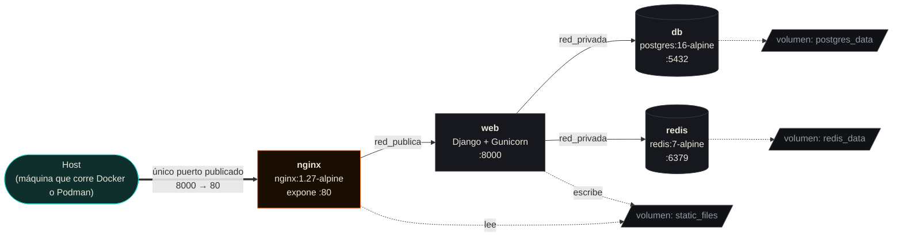

# Instalación y despliegue

## Requisitos

- **Con Docker (recomendado):** Docker Engine 24+ con el plugin Compose v2 (`docker compose`, sin guion).
- **Con Podman (alternativa):** Podman 4.7+ (`podman compose`) o `podman-compose` instalado aparte.
- **Sin contenedores:** Python 3.13, `pip`.

El mismo `docker-compose.yml` sirve para ambos motores sin ningún cambio: usa el formato estándar de Compose, sin extensiones propias de ninguno. Esto se verificó de forma concreta contra instalaciones reales de los dos — ver "Verificación de compatibilidad" más abajo — no se asume por usar un formato de archivo estándar.

## Opción A — Con Docker (arquitectura completa)

Esta es la forma recomendada: levanta los 4 contenedores (`nginx`, `web`, `db`, `redis`) tal como se describe en [`docs/01-arquitectura.md`](01-arquitectura.md).

### 1. Configurar variables de entorno

```bash
cp .env.example .env
```

Editar `.env` y completar como mínimo:

| Variable | Obligatoria | Descripción |
|---|---|---|
| `DJANGO_SECRET_KEY` | Sí (si `DJANGO_DEBUG=False`) | Generar con `python -c "from django.core.management.utils import get_random_secret_key; print(get_random_secret_key())"` |
| `DJANGO_ALLOWED_HOSTS` | Sí (si `DJANGO_DEBUG=False`) | Dominios/IPs separados por coma, sin protocolo |
| `POSTGRES_PASSWORD` | Sí | Contraseña de la base de datos. Sin ella, el contenedor `db` no arranca (falla rápido a propósito, ver `docker-compose.yml`) |
| `DJANGO_DEBUG` | No (default `False`) | `True` solo en desarrollo |
| `HTTP_PORT` | No (default `8000`) | Puerto del host donde queda expuesto Nginx |

`.env` está en `.gitignore`: nunca se sube al repositorio.

### 2. Levantar el stack

```bash
docker compose up --build
```

Esto, en orden:
1. Construye la imagen de `web` (ver `Dockerfile`).
2. Levanta `db` y `redis`, esperando a que sus healthchecks pasen (`pg_isready`, `redis-cli ping`).
3. Levanta `web`: espera activamente a que `db` acepte conexiones (respaldo en `docker-entrypoint.sh` además del `depends_on` de Compose), corre migraciones, ejecuta `collectstatic`, e inicia Gunicorn.
4. Levanta `nginx` recién cuando `web` reporta *healthy* en `/healthz/`.

La aplicación queda en `http://localhost:${HTTP_PORT:-8000}`.

### 3. Verificar que todo esté sano

```bash
docker compose ps            # los 4 servicios deben decir "healthy"
curl http://localhost:8000/healthz/
# {"status": "ok", "database": true}
```

### 4. Crear un superusuario

```bash
docker compose exec web python manage.py createsuperuser
```

Esto crea una cuenta de Django admin (`is_superuser=True`), que `usuarios.decorators.es_admin` reconoce automáticamente como administrador sin necesitar un `PerfilUsuario` con `rol='ADMIN'`.

## Opción A′ — Con Podman (mismos comandos, cambiando el binario)

```bash
cp .env.example .env
podman compose up --build
podman compose ps
podman compose exec web python manage.py createsuperuser
```

No hay un `docker-compose.yml` separado por motor: es el mismo archivo para los dos.

## Opción B — Sin contenedores (SQLite, desarrollo rápido)

Para iterar rápido sin reconstruir imágenes:

```bash
python -m venv venv
source venv/bin/activate          # Windows: venv\Scripts\activate
pip install -r requirements.txt

export DJANGO_DEBUG=True          # Windows (PowerShell): $env:DJANGO_DEBUG="True"
python manage.py migrate
python manage.py createsuperuser
python manage.py runserver
```

Sin `POSTGRES_DB` definida, `config/settings.py` cae automáticamente a SQLite (archivo en `data/db.sqlite3`); sin `REDIS_HOST`, usa cache en memoria del proceso. Ningún paso de Docker/Podman es necesario para este flujo.

## Redes y comunicación entre contenedores



| Servicio | Redes | Puerto publicado al host | Notas |
|---|---|---|---|
| `nginx` | `red_publica` | `${HTTP_PORT}:80` | Único servicio alcanzable desde fuera |
| `web` | `red_publica` + `red_privada` | Ninguno | Solo accesible vía `nginx` |
| `db` | `red_privada` | Ninguno | Solo `web` puede conectarse (por DNS interno: hostname `db`) |
| `redis` | `red_privada` | Ninguno | Solo `web` puede conectarse (hostname `redis`) |

Dentro de la red de Compose, el nombre del **servicio** funciona como hostname DNS — por eso `web` se conecta a `POSTGRES_HOST=db` y `REDIS_HOST=redis` sin necesitar IPs. Esto es igual en Docker y en Podman.

## Volúmenes persistentes

| Volumen | Contenido | Se pierde si... |
|---|---|---|
| `postgres_data` | Todos los datos de la aplicación | `docker compose down -v` / `podman compose down -v` (el `-v` es explícito, no pasa por accidente) |
| `redis_data` | Sesiones activas y cache | Igual que arriba (aunque perderlo solo desloguea usuarios, no pierde datos de negocio) |
| `static_files` | CSS/JS/imágenes recolectados por `collectstatic` | Se regenera automáticamente en cada arranque de `web` |

## Health checks y orden de arranque

Cada contenedor define su propio healthcheck:

- `db`: `pg_isready -U $POSTGRES_USER -d $POSTGRES_DB`
- `redis`: `redis-cli ping`
- `web`: `curl -f http://localhost:8000/healthz/` (el mismo endpoint que consulta un balanceador externo si se agrega uno)
- `nginx`: no tiene healthcheck propio; depende de que `web` esté *healthy* antes de arrancar

`docker-compose.yml` usa `depends_on: condition: service_healthy` para que `web` no arranque hasta que `db`/`redis` respondan, y `nginx` no arranque hasta que `web` responda. Con **Docker Compose v2** (el plugin oficial, reescrito en Go) esto se cumple correctamente en tiempo real — verificado. Con **Podman** hay una salvedad conocida: `podman-compose` 1.0.6 — la versión que instala `apt install podman-compose` en Ubuntu 24.04, probablemente la más común — **no hace cumplir `condition: service_healthy` en tiempo real** ([issue documentado](https://github.com/containers/podman-compose/issues/866); soporte real recién en la 1.3.0). Por eso `docker-entrypoint.sh` no depende de que Compose lo resuelva bien en ningún caso: espera activamente (reintentos con backoff) a que Postgres acepte conexiones antes de migrar, sin importar qué herramienta o versión esté orquestando los contenedores.

## Verificación de compatibilidad

Se probó contra instalaciones reales de ambos motores, no se asumió por usar un formato de archivo estándar:

| Comprobación | Docker (29.1 + Compose 2.40) | Podman (4.9.3 + podman-compose 1.0.6) |
|---|---|---|
| `[docker\|podman] compose config` interpreta el archivo sin errores | Sí | Sí |
| `depends_on: condition: service_healthy` se resuelve en el parseo | Sí | Sí |
| `depends_on: condition: service_healthy` se **respeta en tiempo real** | Sí | No (bug conocido de la 1.0.6; mitigado igual por `docker-entrypoint.sh`) |
| El build ejecuta correctamente los pasos del Dockerfile | Sí | Sí |
| Nombres de contenedor, redes, volúmenes, healthchecks preservados | Sí | Sí |

`docker compose` (v2) y `podman compose` (que en esta versión de Podman delega al mismo `podman-compose` externo) parten del mismo `docker-compose.yml` sin ninguna rama condicional ni archivo alternativo.

## Despliegue en un servidor real

Los pasos anteriores sirven igual para producción, con estas consideraciones adicionales:

1. **TLS:** esta configuración de Nginx sirve HTTP plano puerta adentro; para HTTPS real hace falta certificados (por ejemplo, Let's Encrypt vía Certbot) y un `server` block adicional en `nginx/default.conf`, o un balanceador externo que termine TLS y reenvíe con `X-Forwarded-Proto: https` (que Django ya sabe interpretar, ver `SECURE_PROXY_SSL_HEADER` en `config/settings.py`).
2. **`DJANGO_DEBUG=False` siempre en producción.** El proyecto ya lo exige: si `DJANGO_SECRET_KEY` o `DJANGO_ALLOWED_HOSTS` faltan con `DEBUG=False`, la aplicación rehúsa arrancar (`ImproperlyConfigured`) en vez de correr insegura por accidente.
3. **Respaldos de `postgres_data`:** usar `pg_dump` regularmente (ver [`docs/07-troubleshooting-y-mantenimiento.md`](07-troubleshooting-y-mantenimiento.md) para el comando exacto contra el contenedor).
4. **Secretos:** `.env` es adecuado para un solo servidor. Para más de un host o mayor exigencia de seguridad, considerar Docker secrets o `podman secret` en vez de variables de entorno planas (ver recomendaciones en [`docs/09-estado-del-proyecto.md`](09-estado-del-proyecto.md)).
