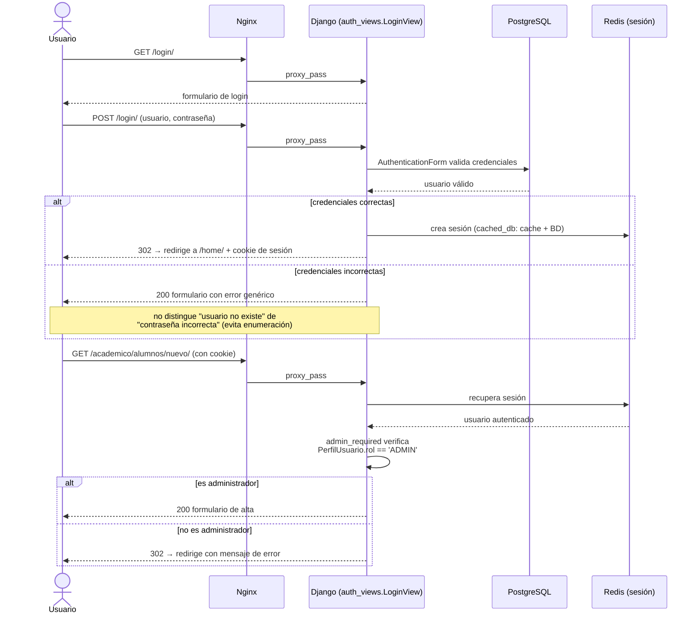

# Autenticación y permisos

## Flujo de login

El sitio usa las vistas de autenticación **nativas de Django** (`django.contrib.auth.views.LoginView`/`LogoutView`), registradas en `config/urls.py`. No hay un sistema de login propio corriendo en paralelo — sí existió código muerto de un segundo flujo (`usuarios.views.iniciar_sesion`/`cerrar_sesion`), pero nunca estuvo enrutado y se eliminó durante la auditoría (ver [`docs/09-estado-del-proyecto.md`](09-estado-del-proyecto.md)).



## Registro de cuentas

`usuarios.views.registro_usuario` (`/usuarios/registro/`) es el único punto de alta de cuentas nuevas. Al registrarse:

1. Se crea el `User` de Django vía `RegistroUsuarioForm` (extiende `UserCreationForm`, hereda las validaciones de contraseña de `AUTH_PASSWORD_VALIDATORS`).
2. Se crea automáticamente un `PerfilUsuario` asociado con `rol='USUARIO'` (nunca `ADMIN` — no existe alta de administradores por autoregistro).
3. Se inicia sesión inmediatamente (`login()`).

Un usuario ya autenticado que visite `/usuarios/registro/` es redirigido a `/` — no puede crear una segunda cuenta sin cerrar sesión primero.

## Sesiones

`SESSION_ENGINE = 'django.contrib.sessions.backends.cached_db'`: la base de datos (`django_session`) es la fuente de verdad, y Redis actúa como capa de lectura rápida encima. Un reinicio de Redis no cierra la sesión de nadie — en el peor caso, la siguiente request de cada usuario paga el costo de una consulta a Postgres para reconstruir la cache.

## Roles y el modelo `PerfilUsuario`

```python
class PerfilUsuario(models.Model):
    usuario = models.OneToOneField(User, on_delete=models.CASCADE)
    rol = models.CharField(choices=[('USUARIO', 'Usuario'), ('ADMIN', 'Administrador')], default='USUARIO')
    estado = models.CharField(choices=[('ACTIVO', 'Activo'), ('BAJA', 'Baja')], default='ACTIVO')
    # + telefono, direccion, fecha_registro
```

Solo existen **dos roles**: `USUARIO` y `ADMIN`. No hay granularidad por módulo (por ejemplo, no existe "admin solo de biblioteca") — es una decisión de diseño simple que cubre las necesidades actuales, documentada acá para que quede explícita la limitación si en el futuro se necesitan permisos más finos.

## La función `es_admin` — única fuente de verdad de autorización

```python
# usuarios/decorators.py
def es_admin(user):
    if not user.is_authenticated:
        return False
    if user.is_superuser or user.is_staff:
        return True
    try:
        return user.perfilusuario.rol == 'ADMIN'
    except PerfilUsuario.DoesNotExist:
        return False
```

Esta función se usa en **tres lugares distintos**, y es intencional que sea una sola función compartida en vez de reimplementar la misma lógica tres veces (así era antes de la auditoría — ver `docs/09-estado-del-proyecto.md`):

1. **`admin_required`** (decorador de vista): bloquea la vista completa si no es admin.
2. **Context processor `usuarios.context_processors.es_admin`**: inyecta `{{ es_admin }}` en *todos* los templates, para mostrar/ocultar botones de administración sin repetir la consulta de rol en cada plantilla.
3. **Chequeos inline** en vistas que mezclan lectura pública con una acción restringida (por ejemplo, `horarios.views.index`, donde cualquier usuario autenticado puede *ver* los horarios pero solo un admin puede *crear* uno desde el mismo formulario).

**Un superusuario o miembro de `is_staff` de Django siempre cuenta como administrador**, incluso sin un `PerfilUsuario` — así `createsuperuser` funciona de inmediato sin pasos adicionales.

## Matriz de permisos por módulo

| Módulo | Lectura | Creación/edición | Baja/eliminación |
|---|---|---|---|
| `alumnos_maestros` | Cualquier usuario autenticado | Solo admin | Solo admin (requiere POST) |
| `calificaciones` | Solo el propio alumno o el docente del curso | Solo el docente del curso | — (no aplica) |
| `horarios` | Cualquier usuario autenticado | Solo admin | Solo admin (requiere POST) |
| `empresas` | Cualquier usuario autenticado | Solo admin | — (no implementado, ver `docs/09-estado-del-proyecto.md`) |
| `billetera` | Cualquier usuario autenticado | Solo admin | — (no implementado) |
| `libros` (catálogo) | Cualquier usuario autenticado | Solo admin | Solo admin (requiere POST) |
| `prestamos` | El propio usuario ve su solicitud; listados completos solo admin | Solicitar: cualquier autenticado. Aprobar/rechazar/registrar: solo admin | — |

`calificaciones` es el único módulo con autorización **a nivel de objeto** (no solo de rol): un docente únicamente puede capturar notas de *sus propios* cursos (`Curso.objects.filter(docente=request.user)`), verificado en cada vista, no solo en la navegación.

## Firma digital de actas — un mecanismo de dos factores real

`calificaciones` incluye un flujo de "firma digital" para cerrar un acta de calificaciones, con doble validación:

1. El docente entra a `/calificaciones/curso/<id>/iniciar-firma/`: se genera un código de 6 dígitos, se guarda en la sesión (`request.session['codigo_firma']`), y se "envía" (hoy, un marcador de posición: se imprime a consola, pendiente de integrar un proveedor real de email/SMS — ver `docs/09-estado-del-proyecto.md`).
2. El docente ingresa ese código **más su contraseña de cuenta** en `/calificaciones/curso/<id>/firmar/`.
3. El servidor valida ambos: el código contra la sesión, y la contraseña contra `request.user.check_password(...)`.

Antes de la auditoría de seguridad, el segundo factor (la contraseña) no se validaba contra nada — cualquier texto no vacío "firmaba" el acta. Esto se corrigió; queda documentado acá porque es la pieza de autenticación más particular de todo el sistema y vale la pena que cualquier persona que la toque entienda qué protege.
