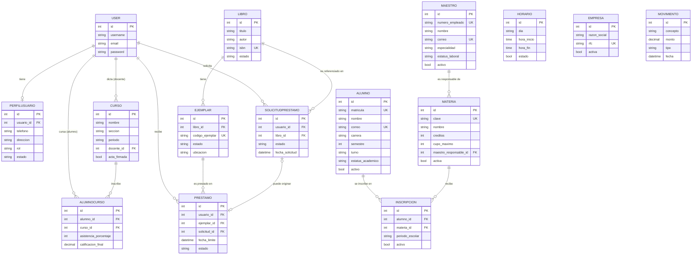

# Base de datos

## Motor

**PostgreSQL 16** en producción (contenedor `db`, ver [`docs/02-instalacion-y-despliegue.md`](02-instalacion-y-despliegue.md)); **SQLite** como *fallback* automático cuando no hay `POSTGRES_DB` definida, para desarrollo sin contenedores. El motor se decide en `config/settings.py` según esa variable de entorno — el resto del código (modelos, vistas, migraciones) es idéntico en ambos casos gracias al ORM de Django.

## Diagrama entidad-relación



Nótese que `HORARIO`, `EMPRESA` y `MOVIMIENTO` no tienen ninguna línea de relación: como se explica en [`docs/01-arquitectura.md`](01-arquitectura.md), son tablas completamente independientes del resto del esquema.

## Descripción por módulo

### `usuarios` — `PerfilUsuario`
Extiende `django.contrib.auth.User` vía `OneToOneField`. Guarda `rol` (`USUARIO`/`ADMIN`), `estado` (`ACTIVO`/`BAJA`), teléfono y dirección. Es la tabla que consulta `es_admin()` en cada chequeo de autorización.

### `alumnos_maestros` — `Alumno`, `Maestro`, `Materia`, `Inscripcion`
El módulo con el modelo de datos más completo del sistema. Puntos a destacar:
- `Alumno.matricula` y `Maestro.numero_empleado` se **autogeneran** en `save()` con formato `ALU-{año}-{consecutivo}` / `DOC-{año}-{consecutivo}` si vienen vacíos.
- `Materia.maestro_responsable` usa `on_delete=models.PROTECT`: no se puede borrar un maestro que tenga materias asignadas (evita huérfanos silenciosos).
- `Inscripcion` tiene una `UniqueConstraint` condicional: un mismo alumno no puede tener dos inscripciones **activas** a la misma materia en el mismo periodo, pero sí puede tener inscripciones inactivas históricas (permite volver a inscribirse tras dar de baja una inscripción anterior).

### `calificaciones` — `Curso`, `AlumnoCurso`
`Curso.docente` y `AlumnoCurso.alumno` son FK directas a `User` (ver la nota de arquitectura sobre esta decisión). `AlumnoCurso.calificacion_final` tiene validadores de modelo (`MinValueValidator(0)`, `MaxValueValidator(10)`) — importante: estos validadores **no se aplican solos** con un `.save()` directo, hace falta llamar `full_clean()` explícitamente o pasar por un `ModelForm`. La vista `grade_entry` lo hace explícitamente por esta razón (ver [`docs/09-estado-del-proyecto.md`](09-estado-del-proyecto.md) para el hallazgo original).

### `horarios` — `Horario`
Modelo mínimo: día de la semana (choices), hora de inicio, hora de fin, estado activo/inactivo. La validación de que `hora_fin` sea posterior a `hora_inicio`, y de que no se traslape con otro horario del mismo día, vive en `HorarioForm.clean()` — no en el modelo, así que un `Horario` creado fuera de ese formulario (por ejemplo, desde el shell o una migración de datos) no queda protegido automáticamente.

### `empresas` — `Empresa`
`rfc` es único a nivel de base de datos (`unique=True`) y se valida en formato (`EmpresaForm.clean_rfc`, patrón `[A-ZÑ&]{3,4}\d{6}[A-Z0-9]{3}`) — valida forma, no el dígito verificador real del algoritmo del SAT.

### `billetera` — `Movimiento`
`monto` es un `DecimalField` sin restricción de rango a nivel de modelo; el formulario (`MovimientoForm.clean_monto`) exige que sea mayor a cero. El saldo mostrado en la lista se calcula en la vista (`billetera_list`) sumando/restando en Python, no con una agregación SQL — aceptable al volumen actual de movimientos, pero sería el primer punto a optimizar si la tabla crece mucho (ver recomendaciones de rendimiento en `docs/09-estado-del-proyecto.md`).

### `libros` — `Libro`, `Ejemplar`
Un `Libro` puede tener varios `Ejemplar` (copias físicas). El estado del ejemplar (`DISPONIBLE`/`PRESTADO`/`DAÑADO`/`BAJA`) es lo que efectivamente determina si se puede prestar — el estado del `Libro` en sí (`ACTIVO`/`BAJA`) es más una bandera de catálogo.

### `prestamos` — `SolicitudPrestamo`, `Prestamo`
Un `Prestamo` puede o no tener una `SolicitudPrestamo` asociada (`on_delete=models.SET_NULL`, `null=True`): los préstamos "directos" (registrados por un admin sin pasar por una solicitud previa) no tienen solicitud de origen. La transición de estados (`PENDIENTE → APROBADA/RECHAZADA`, `ACTIVO → DEVUELTO`) está protegida contra doble procesamiento a nivel de vista (`transaction.atomic()` + `select_for_update()` al aprobar, para que dos aprobaciones simultáneas no presten el mismo ejemplar dos veces — ver `docs/09-estado-del-proyecto.md`).

## Migraciones

Cada app mantiene sus propias migraciones bajo `<app>/migrations/`. Para aplicar cambios de modelo:

```bash
python manage.py makemigrations <app>
python manage.py migrate
```

Con contenedores, correr estos comandos dentro del contenedor: `docker compose exec web python manage.py makemigrations` (o `podman compose exec ...`).

**Nota histórica:** `calificaciones` tiene una migración (`0002_alumnocurso_curso_delete_registro_alumnocurso_curso_and_more`) que borra un modelo `Registro` anterior al rediseño del módulo. El formulario que todavía lo referenciaba (`calificaciones/forms.py`) quedó roto (`ImportError` si algo lo importaba) hasta que se eliminó en la auditoría — ejemplo real de por qué conviene revisar que no queden referencias a un modelo antes de borrarlo en una migración.
