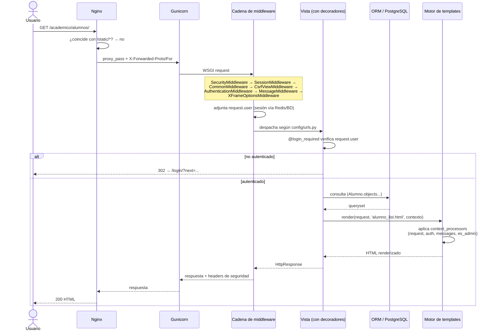

# Rutas y vistas

## Por qué este documento no se llama "documentación de API"

Sistema Escolar **no expone una API REST/JSON**. Es un sitio Django tradicional: cada ruta renderiza HTML en el servidor y el navegador hace *submits* de formularios normales. El único endpoint que devuelve JSON es `/healthz/` (pensado para que lo consulte Podman o un balanceador, no una persona). Si en el futuro se necesita una API real (por ejemplo, para una app móvil), el candidato natural es agregar Django REST Framework como una capa nueva — hoy no existe.

## Ciclo de vida de una petición

## Mapa de rutas

Prefijo raíz definido en `config/urls.py`. `Auth` indica el nivel de acceso real verificado en la vista (no solo lo que muestra el menú).

### Raíz (`config/urls.py`)

| Ruta | Nombre | Auth | Descripción |
|---|---|---|---|
| `GET /healthz/` | `healthcheck` | Ninguna | Verifica app + conexión a BD. Usado por Podman/balanceador. |
| `/admin/` | — | Staff de Django | Admin nativo de Django |
| `GET,POST /login/` | `login` | Ninguna | Login (vista nativa de Django) |
| `POST /logout/` | `logout` | Cualquier autenticado | Cierra sesión (requiere POST) |
| `GET /` | `home` | `@login_required` | Panel principal con los módulos disponibles |

### `/academico/` — `alumnos_maestros`

| Ruta | Nombre | Auth |
|---|---|---|
| `GET /academico/` | `dashboard` | Autenticado |
| `GET /academico/alumnos/` | `alumno_list` | Autenticado |
| `GET,POST /academico/alumnos/nuevo/` | `alumno_create` | Admin |
| `GET,POST /academico/alumnos/<pk>/editar/` | `alumno_update` | Admin |
| `POST /academico/alumnos/<pk>/desactivar/` | `alumno_deactivate` | Admin |
| `GET /academico/maestros/` | `maestro_list` | Autenticado |
| `GET,POST /academico/maestros/nuevo/` | `maestro_create` | Admin |
| `GET,POST /academico/maestros/<pk>/editar/` | `maestro_update` | Admin |
| `POST /academico/maestros/<pk>/desactivar/` | `maestro_deactivate` | Admin |
| `GET /academico/materias/` | `materia_list` | Autenticado |
| `GET,POST /academico/materias/nueva/` | `materia_create` | Admin |
| `GET,POST /academico/materias/<pk>/editar/` | `materia_update` | Admin |
| `POST /academico/materias/<pk>/desactivar/` | `materia_deactivate` | Admin |
| `GET /academico/inscripciones/` | `inscripcion_list` | Autenticado |
| `GET,POST /academico/inscripciones/nueva/` | `inscripcion_create` | Admin |
| `POST /academico/inscripciones/<pk>/desactivar/` | `inscripcion_deactivate` | Admin |

### `/calificaciones/`

| Ruta | Nombre | Auth |
|---|---|---|
| `GET /calificaciones/dashboard/` | `calificaciones_dashboard` | Autenticado (vista distinta si es docente o alumno) |
| `GET,POST /calificaciones/curso/<id>/calificaciones/` | `grade_entry` | Solo el docente del curso |
| `GET /calificaciones/curso/<id>/iniciar-firma/` | `iniciar_firma` | Solo el docente del curso |
| `GET,POST /calificaciones/curso/<id>/firmar/` | `digital_signature` | Solo el docente del curso |
| `GET /calificaciones/curso/<id>/pdf/` | `generar_pdf` | Docente del curso o alumno inscrito |

### `/horarios/`

| Ruta | Nombre | Auth |
|---|---|---|
| `GET,POST /horarios/` | `horarios_index` | Lectura: autenticado. Creación (POST): admin |
| `GET,POST /horarios/editar/<id>/` | `editar` | Admin |
| `POST /horarios/eliminar/<id>/` | `eliminar` | Admin |

### `/empresas/`

| Ruta | Nombre | Auth |
|---|---|---|
| `GET /empresas/` | `empresa_list` | Autenticado |
| `GET,POST /empresas/nueva/` | `empresa_create` | Admin |

*(No hay edición ni baja de empresas todavía — ver `docs/09-estado-del-proyecto.md`.)*

### `/billetera/`

| Ruta | Nombre | Auth |
|---|---|---|
| `GET /billetera/` | `billetera_list` | Autenticado |
| `GET,POST /billetera/nuevo/` | `movimiento_create` | Admin |

### `/libros/`

| Ruta | Nombre | Auth |
|---|---|---|
| `GET /libros/` | `lista_libros` | Autenticado |
| `GET,POST /libros/nuevo/` | `crear_libro` | Admin |
| `GET,POST /libros/editar/<id>/` | `editar_libro` | Admin |
| `POST /libros/eliminar/<id>/` | `eliminar_libro` | Admin |
| `GET /libros/ejemplares/` | `lista_ejemplares` | Admin |
| `GET,POST /libros/ejemplares/nuevo/` | `crear_ejemplar` | Admin |
| `GET,POST /libros/ejemplares/editar/<id>/` | `editar_ejemplar` | Admin |
| `POST /libros/ejemplares/eliminar/<id>/` | `eliminar_ejemplar` | Admin |

### `/prestamos/`

| Ruta | Nombre | Auth |
|---|---|---|
| `GET,POST /prestamos/solicitar/` | `solicitar_prestamo` | Autenticado |
| `GET /prestamos/solicitudes/` | `lista_solicitudes` | Admin |
| `POST /prestamos/solicitudes/aprobar/<id>/` | `aprobar_solicitud` | Admin |
| `POST /prestamos/solicitudes/rechazar/<id>/` | `rechazar_solicitud` | Admin |
| `GET,POST /prestamos/registrar/` | `registrar_prestamo` | Admin |
| `GET /prestamos/activos/` | `prestamos_activos` | Admin |
| `POST /prestamos/devolver/<id>/` | `registrar_devolucion` | Admin |

### `/usuarios/`

| Ruta | Nombre | Auth |
|---|---|---|
| `GET,POST /usuarios/registro/` | `registro_usuario` | Público (redirige si ya está autenticado) |
| `GET /usuarios/perfil/` | `perfil_usuario` | Autenticado |

## Convención de acciones destructivas

Toda acción que cambia estado (desactivar, eliminar, aprobar, rechazar, registrar devolución) **exige POST**, decorada con `@require_POST` además de `@admin_required`. Ningún enlace `<a href>` dispara una mutación — las plantillas envían estas acciones como formularios con ``. Esto no siempre fue así: la auditoría de seguridad encontró varias de estas acciones disparándose con un simple GET (ver `docs/09-estado-del-proyecto.md`).
